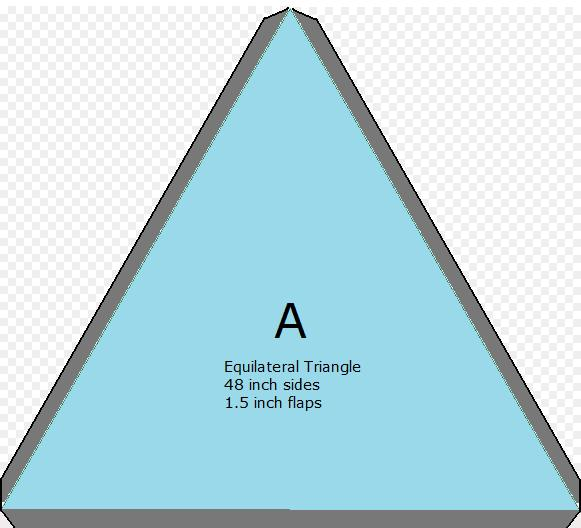
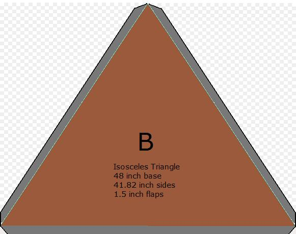
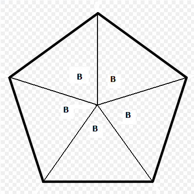
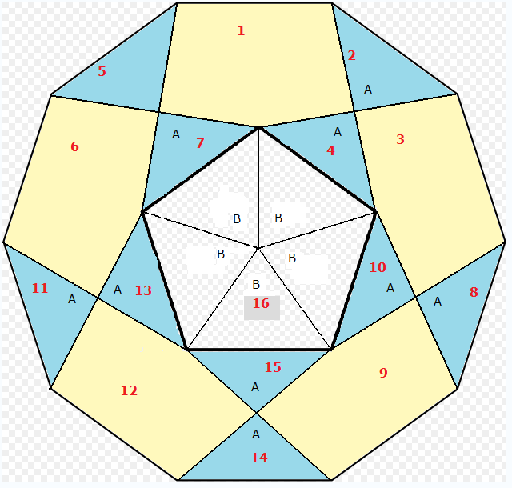
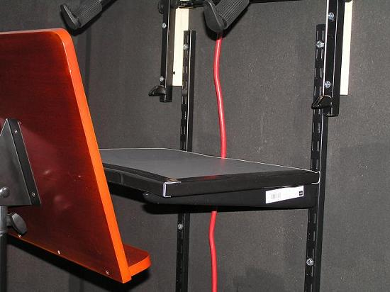
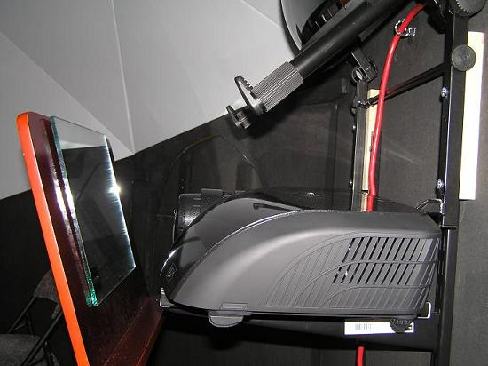

+++
title = "Construction of the Dome"
weight = 200
+++

To construct the dome, go through the following procedure:

1. Purchase the necessary materials:
   * 40 sheets of corrugated cardboard, ideally with one side already white,
     48 x 48 inches. Purchase an extra one or two if mistakes might be made.
     Alternatively slightly fewer sheets are needed with 48 x 96 inch
     cardboard sheets (as three of the smaller triangles can be cut per sheet)
     but there is a transport issue with sheets of this size! So either buy 40
     48 x 48 inch sheets, or 15 48 x 96 inch sheets, plus a few extra as
     spares.
   * 65 large (2 or more inch wide) paper binder clips. This provides three
     clips per joint.
   * Black paper sheets totaling 48 inches long by 110 inches wide.
   * Matt flat grey (not white) paint.
3. Acquire the necessary tools:
   * Sharp knife.
   * Long metal edged scale.
   * Sharp point, string, and pencil.
   * Paint brushes, cleaning materials, newspaper.
5. Very carefully draw out and then cut out the template triangles. Two sizes
   of triangle are necessary, labeled as A and B in the following diagrams:
   
   Use the full width of the 48 inch sheets.

   To draw the triangle you can use a sharp point with a string 48 inches
   long, and draw two arcs. Where the arcs intersect is the tip of the
   triangle. Alternatively calculate the height of the triangle (41.57
   inches) - measure this along both edges of the cardboard, then draw a line
   from one side to the other, and mark the center - 24 inches along the line.

   After cutting out the template, 10 triangles of type A are needed.

   _Note that the triangle is 48 inches on all sides, and that the flaps are
   in addition to this. This is possible on a sheet of cardboard only 48
   inches wide by having the tapered flaps shown at the corners._

   

   After cutting out the template, 30 triangles of type B are needed. This
   will require 30 48 x 48 inch sheets, or 10 48 x 96 inch sheets, as three
   triangles can be cut from the larger sheet.

   13/16ths is a good approximation for .82 inch. The height of the triangle
   is 34.25 inches.

   _Note that the triangle is 48 inches on one side, and 41.82 on the other
   two sides, and that the flaps are in addition to this._

7. When each triangle is cut out label the outside (not the white side if
   white-sided cardboard is used), with the letters A or B.

8. Mark the lines where the flaps need to be folded with a pencil, then use a
   dull point like a ball-point pen to score the cardboard without cutting it
   to much. Practice on some scraps to gain some expertise first. Score the
   cardboard triangles accurately and fold the flaps out.

9. Double check you have the correct quantities: 10 of triangle A, 30 of
   triangle B, not including the two template triangles (which should be
   stored separately and _not_ painted - in case you need to redo one or more
   triangles).

10. At this stage the inside of the triangles should be painted a flat matt
    latex grey. If white cardboard is used this should not take more than one
    coat of paint. Make sure that the painting is done in a ventilated area,
    and appropriate breathing masks are used. Brown cardboard may take a
    second coat of paint. Although the temptation is to use a pure white
    paint, this will reflect too much of the projection. A flat, light grey
    should give the best results. It is not necessary to paint the flaps
    completely, but paint over the edges of the triangles and into the flap
    area to ensure good coverage.

    <!--  NOT FOUND -->

    Painting is fun — though is usually done on a flat level surface!

12. After the cardboard is painted it may bow to varying degrees. When the
    paint is dry consider stacking the triangles, perhaps with half facing the
    opposite direction, with a weight carefully placed on top to help
    counteract the bowing effect of the paint.  In any case when the flaps are
    turned out this will tend to flatten out the triangles again considerably,
    so the bowing is not the serious issue that it might first look.

13. _Optional step_. Make black shades to block out light along the edges of
    the pentagon. There are 55 sides internal to the dome, and 10 sides around
    the base. The 55 internal edges are a mix of 48 and 41.8 inches. Cut out
    strips of black paper long enough that two overlapping pieces will cover
    the whole edge. Obviously shorter pieces can be used for the 41.8 inch
    sides. The internal strips should be 2.25 inches wide (assuming cardboard
    that is one eighth of an inch wide), with a fold at 1 and 1.25 inches
    along their full length. If the cardboard you have used is not one eighth
    of an inch wide, then the thickness of the square folds should simply be
    twice the thickness of the cardboard. The folds need to be very straight
    for the shades to fit neatly onto the edges. If a single fold is used the
    shades will tend to keep the binder clips out from the join, which weakens
    the structure and is prone to error. The reason why this step is optional
    is that to get straight folded edges can require paper folding equipment
    that might not be readily available. The images show a folding machine and
    the completed shades. For the external 10 sides around the base, the paper
    strips should be 3 inches wide, folded at 1 and 2 inches along the entire
    length of the strip.

   <!--  NOT FOUND -->

   A paper folding machine is the best approach to getting very straight folds.

   If such a folding machine is not available, try other long straight edges
   such as a metal ruler.

   <!--  NOT FOUND -->

   First mark a sheet of black paper where it needs to be cut and folded. Then
   fold the sheet twice to create the quarter inch square end. Then cut out
   the strip. Repeat until every edge has two shades.

   The image shows a quarter inch fold for the triangles, and a one inch fold
   for the base.

   <!--  NOT FOUND -->

   A pentagon with shades attached.

15. Time to get out those paper clips. Start with all the triangle Bs. These
    are used to make the pentagons. Very carefully align the shorter edges of
    the B triangles, place one or more of the black shades along each joint,
    and clip together a pentagon. Note that joining the last side will lift
    the center of the pentagon about 9 inches. Ensure there is enough space
    around so that these pentagons are not stepped on.

    

    The outside edges of the pentagon should all be the longer 48 inch sides.

    The 30 triangle Bs should be assembled into six pentagons.

17. With a lot of labor assistance (a minimum of five people works well),
    assemble the dome in the order shown in the following diagram:

    

    Note that the central polygon is the very last piece to be assembled. The
    dome will be quite floppy until this is done, and a lot of hands are
    helpful at this stage.

    <!--  NOT FOUND -->

    When building the dome try to align the points and edges as accurately as
    possible before proceeding to the next.

    <!--  NOT FOUND -->

    The critical stage in assembly is having enough hands inside the dome to
    complete all but the top pentagon.

    Because of the difficulty in clipping in the top pentagon, consider having
    someone stand on a stepping stool and held in place by a second person,
    whilst the first leans over the dome and clips in the five last sides. The
    people on the inside need to support both the last top pentagon, and all
    the sides - at the same time.

    Only when the last top pentagon is clipped into place does the dome become
    self-supporting.

19. Admire your work! The dome should now be reasonably rigid.
20. Ensure all the flaps of the lower edge are bent out, and carefully lift
    the dome onto the support - with each of the 10 corners supported by an
    assistant (hence the need for a minimum of five people). Do not lift the
    dome at any time other that at its corners. Obviously the corners and 48
    inch edges of the dome should match the ledges of the dome support
    exactly.
21. Use the 20 heavy duty clips to attach the dome to the support, two clips
    per side.

    <!--  NOT FOUND -->

    The height of the dome when it is on the floor and before it is tilted is
    just under 6.5 feet. After the 20 degree tilt the height is about 6 feet.
    Add to this the height of the center of the dome support (just over 3
    feet), and the height of the planetarium is a few inches over 9 feet.

23. Open up a door and go inside!

    <!--  NOT FOUND -->

### To Construct a Smaller Dome

To construct a dome to fit the 36 inch side dome support, triangle A should be
an equilateral triangle with 36 inch sides. Triangle B should be an isosceles
triangle with a 36 inch base and two sides of 31 3/8 inches.

The height of a planetarium of this size is around 7 feet. The following
images shows the relative sizes of the domes.

<!--  NOT FOUND -->

| 48 inch triangle planetarium | 36 inch triangle planetarium |
| :-- | :-- |

## Adding Ventilation and Power

Adding ventilation to the planetarium will make the experience more pleasant
for most people. Electric power will be needed to power the external fan, and
also obviously to power the internal projector.

1. Purchase or acquire a small extractor fan (the fan must be capable of going
   into reverse - to extract the air - rather than just blow warm air).
2. Using black foam-board, or a similar material, construct a box as shown in
   the image below.

Pics of fan and box

4. Power up the fan and check that the ventilation system works.
5. Run a black power cable (25, 30 or even 50 feet) through one of the
   ventilation grill holes and up and over one of the doors so that the power
   outlets are available to the projector that will be sitting on a shelf
   between the two doors. Consider using safety hooks (cup hooks that close
   with a spring), or similar small hooks, to guide the power cable. Ensure
   that it does not cross the floor at any stage inside the dome support,
   where it could be tripped on., and follows a safe path to the power outlet
   outside of the planetarium. If the power cable or hooks are not black, then
   consider painting the hooks and covering the cable inside the planetarium
   with black tape.

   <!--  NOT FOUND -->

   The cable in this image has been left red to show its course. Covering the
   cable with black tape for the inside section ensures minimal reflectivity.

## Adding Seating and Carpeting

Ideally the viewers inside the planetarium will be seated entirely below the
base line of the dome - this is to ensure that no part of them blocks the
reflection from the mirror onto the dome surface. In practice this may be
difficult to achieve, especially if height was an issue during construction.
The suggested layout is to lay black carpet tiles across most of the floor of
the planetarium, with perhaps a few seats set at the back near the projector.
Shorter viewers sit at the front and middle of the planetarium, on the carpet,
taller viewers can use the seats at the back. The exact layout depends on the
number of viewers you plan to accommodate at any one time - all carpeting and
no seats, or all seats and no carpeting, are obviously options too.

<!--  NOT FOUND -->

The seats, similar to all items under the dome, should be as matt black as
possible.

## Setting up the Projector and Mirrors

1. The mirror needs to be a half-dome spherical mirror as shown in the image
   below.

   [High Quality Mirrors](#highqualitymirrors)

   <!--  NOT FOUND -->

   Experimenting with different sizes of spherical mirror. The smaller,
   approximately 9 inch radius, worked well in our tests.

4. The projector should provide as high a definition as possible. Ideally the
   projector should be capable of full HD, 1920 x 1080p HD for example (which
   gives a 16 x 9 aspect ratio). Such a projector will require a DVI or HDMI
   cable

   <!--  NOT FOUND -->

   A DVI cable.

6. The mirror should be placed in the direct center on the highest side of the
   dome support, angled downwards at an angle of 20 degrees, and its base
   should be at the same height at the base of the dome. The support for the
   mirror can be made out of wood, cut to give a 20 degree angle, or other
   options can be used to provide some fine adjustment should it be necessary
   or helpful. In the image below a second tier keyboard support (for a music
   keyboard) has been cut and drilled to provide a mirror support that can
   both take a variable size of mirror, and have the angle of the mirror
   finely adjusted.

   <!--  NOT FOUND -->

8. The projector needs to be placed pointing up at the mirror so that the
   image is reflected off the mirror to fill the dome, but not the dome
   support. For this a solid support system is needed that will safely hold
   the projector at an angle of about 20 degrees, and provide fine turning
   adjustment. One good solution to this is to use a solid music or conductors
   stand (as shown in the image below). These can be found reasonably cheaply
   (around $50) and are surprisingly sturdy. Find one that enables adjustment
   in both side to side, and up and down directions, and is variable in height
   from around 24 to 40 inches.

   <!--  NOT FOUND -->

   Primary projection.

   <!--  NOT FOUND -->

   Even though a music stand is designed to hold just paper, a sturdy one can
   easily support and hold a projector at an angle.

10. An alternative to the primary projection described in step 4, is to use a
    secondary mirror. Use of a secondary mirror has the advantage that the
    projector and support are no longer near the center of the dome using up
    valuable spectator space. However the downside to using a secondary mirror
    is that it involves additional cost (of the secondary mirror itself, and
    some shelving), and complicates the alignment - the projector, secondary
    mirror, and spherical mirror now all have to be aligned simultaneously and
    correctly.

    <!--  NOT FOUND -->

    Secondary projection.

    

    To use the secondary mirror method of projection, first install a shelving
    system that enables a variation in the height of the projector. The shelf
    itself should be about 24 inches wide and 13 inches deep - though this
    does obviously depend on the size of the projector you intend to use.

    

    Place the projector on the shelf so that the lens is centered - which is
    why the shelf should be 24 inches wide, and not simply the width of a
    projector.

    The secondary mirror should be aligned at the top of the music stand.
    Heavy duty Velcro (or similar) can be used to attach the mirror.

    The fine alignment of the three main elements (projector, secondary
    mirror, spherical mirror) will involve some minor adjustments to the
    angles of each to get a complete image projected onto the dome.

    Note how close the secondary mirror is to the projector. Just enough room
    is needed so that the reflected image clears the projector itself and
    finds the spherical mirror.

    This system frees up the center of the dome quite well.

### High Quality Mirrors

Most mirrors reflect light from two surfaces, the inside and outside faces of
the glass or plastic. Unfortunately this means that there will be two images
in view on the dome for each single object in the simulated sky - the intended
image and a second fainter image slightly offset from the first. This problem
is doubled if a secondary mirror also with two reflective surfaces is used -
in this case there will now be four images on the dome, the intended one and
three fainter ghost images. This problem can be eliminated with the use of
high quality first surface mirrors. These mirrors, both flat and spherical,
have only one reflective surface, so even when a secondary mirror is used no
unwanted ghost images appear on the dome. Of course the issue here is cost,
first surface mirrors are a few times more expensive than normal mirrors.

The use of first surface mirrors is recommended if your budget allows!
